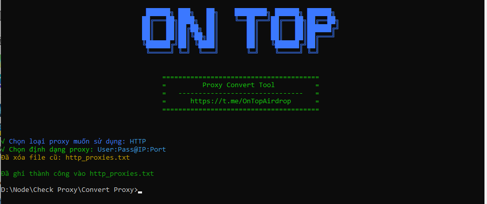

How to Use the Batch Proxy Switcher

1. **Prepare Proxy File**:
Create a proxy.txt file containing proxies, one proxy per line.

2. **Install Library**:
- Install:
`npm install`

3. **Run Script**:
- Run:
`node runv2.js`

4. **Select Configuration**:
- Select proxy type (HTTP, SOCKS4, SOCKS5).
- Select proxy format (IP:Port, User:Pass@IP:Port, User:Pass:IP:Port).

5. **Result**:
- The result file will be saved to the current directory (eg: http_proxies.txt).

Good luck!
## Donations

If you would like to support the development of this project, you can make a donation using the following addresses:

- **Solana**: `3rYhoVL8g28iwjGQq8hKw4bvVmBGhyC8DEbKAwzmy4wn`
- **EVM**: `0x431588aff8ea1becb1d8188d87195aa95678ba0a`
- **BTC**: `bc1pu30mhlegcajqq23ff30vrlnlnsmv0ha6ufwaenv0em4ap8dfzyrqwsvjx5`

## Contributing

Feel free to open issues or submit pull requests if you have improvements or bug fixes.

# WARNING
⚠️ "User assumes all responsibility and risk associated with the use of this bot/program script."

## License

This project is licensed under the MIT License. See the [LICENSE](LICENSE) file for details.
